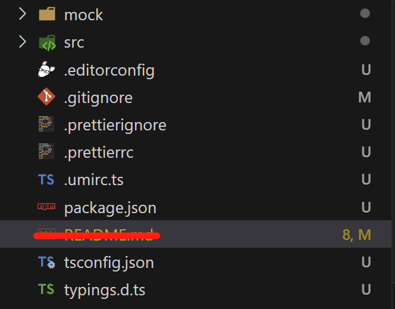

# UMI学习
## 快速上手
### 环境准备
由于工作项目中用了umi3，所以笔者以umi3来开端
确保本地有node和yarn，node要求10.13版本及以上
### 脚手架
通过官方工具创建项目
```bash
yarn create @umijs/umi-app
```
如下图，这些内容都是有上述工具创建的

### 安装依赖
```bash
yarn
```
### 启动项目
```bash
yarn start
```